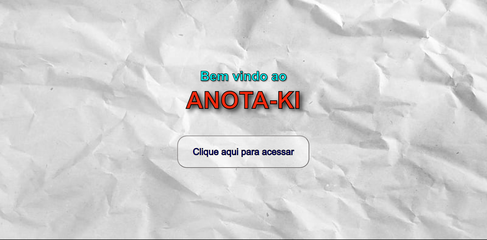
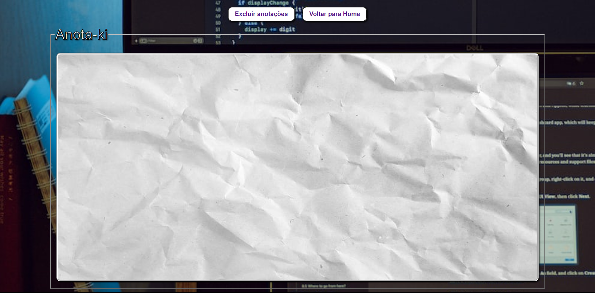

# Anota-Ki - Agenda Segura

Deploy: (https://agendasegura.vercel.app/home.html)

## Sobre

Criei este aplicativo para auxiliar no dia a dia para copiar/colar, escrever, digitar códigos e etc, enfim, uma variedade meios para que não seja necesário abrir uma programa de texto para isso.

### Objetivo

Praticar o desenvolvimento de HTML, CSS e JavaScript de forma independente, utilizando meus conhecimentos atuais sem pesquisar linhas de código na internet.

### Desafio

Concluir este projeto sem ser auxiliado por nenhuma fonte, somente com meus conhecimentos atuais. Pretendo melhorar este projeto, adicionando local storage e tela de login para que fique de fato armazenado anotações de forma segura e que não se perca ao fechar página.

### Conclusão

Consegui concluir a primeira versão desta ferramenta, fiquei contente com o resultado e consegui perceber a minha evolução. Com esse projeto completo 100 dias de código todo dia. Infelizmente perdi o streak do Github, mas o que vale é o conhecimento que adquiri com todos esses dias e isso não tem como ser perdido.

### Ferramentas Utilizadas

- HTML
- CSS
- Javascript